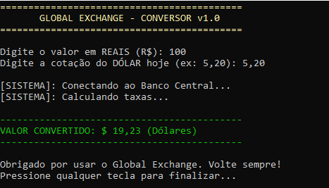

# 🎮 Heurísticas de Nielsen Aplicadas no Console

Este projeto de conversão de moedas no console aplica três heurísticas de usabilidade de Jakob Nielsen para melhorar a experiência do usuário.

## 🔄 Visibilidade do Status do Sistema
O sistema informa o usuário sobre o que está acontecendo por meio de mensagens como  
“Conectando ao Banco Central...” e animações com pontos, garantindo transparência durante o processamento.

## 🛡️ Prevenção de Erros
A estrutura **try-catch** trata entradas inválidas, evitando que o programa seja encerrado inesperadamente e exibindo mensagens claras quando ocorre um erro.

## 🎨 Estética e Design Minimalista
O uso de cores, separadores e mensagens diretas mantém a interface simples, organizada e fácil de entender, focando apenas nas informações essenciais.

---

## 📸 Evidência de Execução

